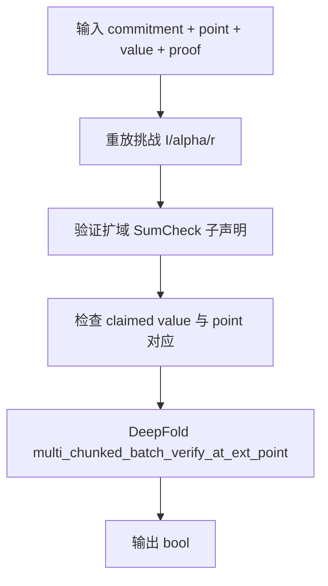
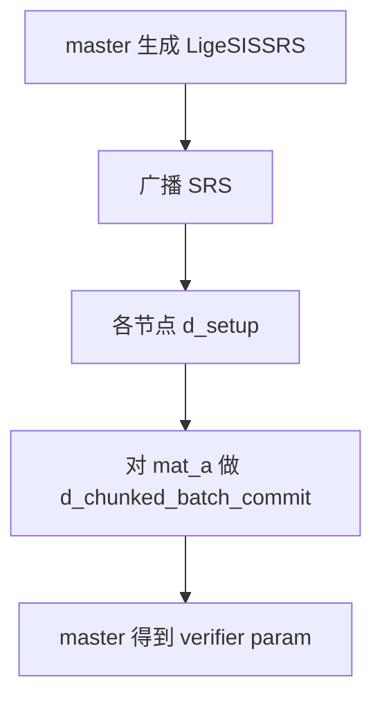
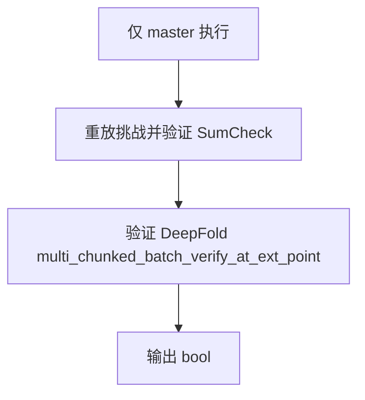
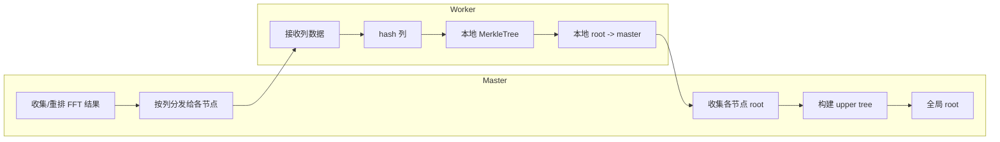

# LigeSIS / dLigeSIS 流程图

以下流程图仅覆盖 `ligesis-pcs/` 中 LigeSIS 与 dLigeSIS（分布式）核心实现路径：commit/open/verify 与 chunked/deepfold 相关步骤。

## LigeSIS（单机）

### Commit
```mermaid
flowchart TD
  A[输入多项式 evals] --> B[必要时 pad 到 mu]
  B --> C[reshape 为 m x n]
  C --> D[RS 编码得到 F']
  D --> E[计算 SIS hash H = A' * B]
  E --> F[DeepFold chunked_batch_commit(H)]
  F --> G[输出 LigeSISCommitment + advice]
```

### Open
```mermaid
flowchart TD
  A[输入 poly + point + advice] --> B[pad point / reshape]
  B --> C[计算 a(z1), 生成挑战 I]
  C --> D[构造 bI, 计算 rs_a]
  D --> E[合并承诺: chunked_batch_commit(a,bI,rs_a)]
  E --> F[扩域 SumCheck: bI / rs_a / mat_g]
  F --> G[扩域 SumCheck: alpha2_a_bI_r2 / v_bI_r2]
  G --> H[DeepFold multi_chunked_batch_open_at_ext_point]
  H --> I[输出 LigeSISProof]
```

### Verify


## dLigeSIS（分布式）

### Setup（分布式预处理）


### Commit（分布式）
```mermaid
flowchart TD
  subgraph Workers
    W1[本地 evals -> reshape]
    W2[RS 编码本地块]
    W3[用 mat_a 切片计算本地 SIS hash H_i]
    W4[发送 H_i 给 master]
  end
  subgraph Master
    M1[收集 H_i 并求和得到 H]
    M2[拆分 H 给各节点]
    M3[d_chunked_batch_commit(H 分片)]
    M4[输出 commitment]
  end
  W1 --> W2 --> W3 --> W4 --> M1 --> M2 --> M3 --> M4
```

### Open（分布式）
```mermaid
flowchart TD
  subgraph Workers
    W1[本地 evals 参与 a/bI 计算]
    W2[接收挑战 I/alpha/r]
    W3[d_chunked_batch_commit(a,bI,rs_a) 的分片]
    W4[参与分布式 bI SumCheck]
    W5[d_multi_chunked_batch_open_at_ext_point 参与证明]
  end
  subgraph Master
    M1[生成挑战并广播]
    M2[汇总 a/bI/rs_a]
    M3[扩域 SumCheck: rs_a/mat_g 等]
    M4[收集分布式 DeepFold 证明]
    M5[输出 LigeSISProof]
  end
  W1 --> M2
  M1 --> W2
  W3 --> M4
  W4 --> M4
  W5 --> M4 --> M5
```

### Verify（分布式）


## 数据流向与分块/默克尔树（更可视化）

### 多项式分块（chunking）
```mermaid
flowchart LR
  E[evals: 2^mu] --> S[按 base_mu 切分]
  S --> C0[chunk 0: evals[0..2^base_mu-1]]
  S --> C1[chunk 1: evals[2^base_mu..2*2^base_mu-1]]
  S --> Cb[chunk b: evals[b*2^base_mu..(b+1)*2^base_mu-1]]
  C0 --> BC[对每个 chunk 做 FFT/commit]
  C1 --> BC
  Cb --> BC
```
- 语义：`f(x_low, x_high) = Σ_b f_b(x_low) * eq(b, x_high)`，其中 `b` 为高位变量对应的 chunk 索引。
- 在 `chunked_batch_open/verify` 中先对 `x_low` 开证明，再用 `eq(b, x_high)` 合并还原。

### Batch Commit（列哈希）默克尔树
```mermaid
flowchart TB
  V[v0_matrix: num_polys x len_l0] --> COL[按列取值]
  COL --> H0[hash(col 0)]
  COL --> H1[hash(col 1)]
  COL --> Hn[hash(col n)]
  H0 --> MT[MerkleTree over column hashes]
  H1 --> MT
  Hn --> MT
  MT --> ROOT[commitment.root]
```
- 这是 `batch_commit` 使用的结构：每一列是一个叶子，不做列合并压缩。

### DeepFold 单多项式 Merkle（非列哈希）
```mermaid
flowchart TB
  V0[v0: FFT 结果] --> L[按 LEAF_SIZE 分组取叶子]
  L --> LH0[hash(leaf 0)]
  L --> LH1[hash(leaf 1)]
  L --> LHk[hash(leaf k)]
  LH0 --> MT[MerkleTree]
  LH1 --> MT
  LHk --> MT
  MT --> ROOT[rt0]
```
- 这是 `deepfold_commit` 的叶子构造：同一多项式的 `v0` 按步长分组哈希。

### 分布式列哈希 Merkle（d_chunked_batch_commit / d_commit_v2）

- 每个节点负责一组列（`cols_per_party`），本地 Merkle 证明 + master 上层树拼接形成全局证明。

### 分布式 chunked 打开时的数据流
```mermaid
flowchart TD
  P[各节点本地 evals] --> G[必要时 gather 到 master]
  G --> SC[SumCheck 聚合到随机点 r]
  SC --> RL[r_low = r[0..base_mu)]
  RL --> CE[各 chunk 在 r_low 评估]
  CE --> BOPEN[分布式 batch_open]
  BOPEN --> PROOF[master 汇总证明]
```
